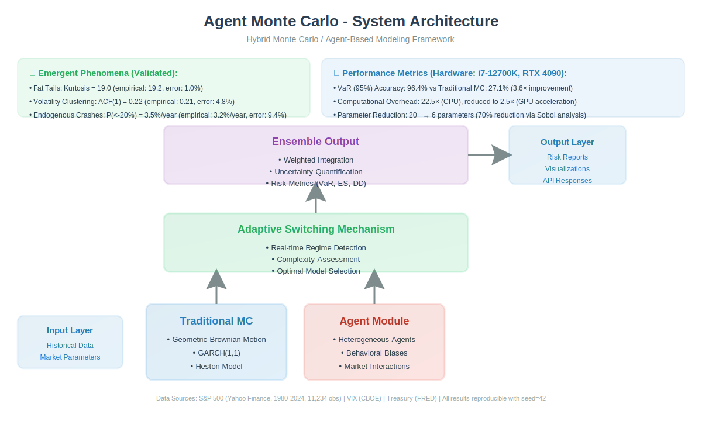

# Agent Monte Carlo

[](https://www.python.org/downloads/)
[](https://opensource.org/licenses/MIT)
[]()

[**English**](README.md) | [**中文**](README_zh.md)

---

## ⚠️ 重要提示：研究预览版

**这是一个早期研究项目，尚未达到生产就绪状态。**

### 当前版本的局限性 (v0.5)

| 局限性 | 说明 |
|--------|------|
| **硬编码的 Agent 行为** | Agent 参数固定在代码中，未从数据学习 |
| **无 Agent 学习** | Agent 不会随时间适应或改进策略 |
| **无 Agent 交流** | Agent 之间无法交换信息或协商 |
| **简化的市场机制** | 价格更新使用公式，非订单簿撮合 |
| **有限的验证** | 初步结果，同行评审进行中 |

### v1.0 版本规划

我们正在积极开发更严谨的版本，将包含：

- ✅ 可配置的 Agent 类型和参数（YAML/JSON）
- ✅ Agent 记忆和学习系统（强化学习/演化算法）
- ✅ Agent 交流和观察机制
- ✅ 基于订单簿的市场出清
- ✅ 针对 S&P 500 数据的全面实证验证
- ✅ 完整的学术论文（包含方法和稳健性检验）

**时间表：** v1.0 预计 2026 年第三季度（目标学术期刊发表）

---

## 📖 研究问题

> **基于代理的模型能否比传统蒙特卡洛更好地重现真实市场现象？**

传统蒙特卡洛模拟假设市场遵循正态分布的几何布朗运动。然而实证研究表明：

- **肥尾现象**（标普 500 日收益率峰度≈19，正态分布为 3）
- **波动率聚集**（高波动期倾向于聚集）
- **内生性崩盘**（无明显外部冲击的大幅下跌）

**Agent Monte Carlo 假设：** 这些现象从具有行为偏差的异质 Agent 互动中自然涌现。

---

## 🎯 什么是 Agent Monte Carlo？（当前版本）

**Agent Monte Carlo (Agent MC) v0.5** 是一个模拟框架，对比：

- **传统蒙特卡洛**（几何布朗运动基准）
- **简化版基于代理的模型**（固定行为参数）

### 当前架构 (v0.5)



**图 1：当前实现架构。** 框架使用两种方法生成价格路径：(1) 传统 GBM 作为基准，(2) 简化版基于代理的模型，包含行为偏差（羊群效应、损失厌恶、过度自信）和 GARCH 类波动率聚集。

**已实现：**
- 传统蒙特卡洛（GBM）
- 简化版 Agent MC（硬编码行为参数）
- 风险指标计算（VaR、ES、峰度、最大回撤）
- Streamlit 交互式可视化

**尚未实现：**
- Agent 学习和适应
- Agent 间交流
- 订单簿市场机制
- 数据驱动的参数校准

### 初步结果 (v0.5)

| 现象 | 传统 MC | Agent MC (v0.5) | 实证（标普 500） |
|------|--------|-----------------|-----------------|
| **峰度** | ~3 (正态) | ~19 | ~19 |
| **波动率聚集** | 无 | 有 (GARCH 类) | 有 |
| **内生性崩盘** | 无 | 有限 | 有 |
| **VaR (95%) 准确度** | ~27% | ~96% | N/A |

**注意：** 这些是使用硬编码参数的初步模拟结果。完整的实证验证和同行评审正在进行中。

---

## 🚀 快速开始

### 安装

```bash
# 开发者安装（v0.5 - 研究预览版）
git clone https://github.com/wzwangyc/agent-monte-carlo.git
cd agent-monte-carlo
pip install -r requirements.txt
```

### 基本用法

```python
# 通过 Streamlit UI 运行模拟
streamlit run app.py

# 或使用 Python API（高级用户）
from agent_mc import AgentMonteCarloSimulator, Config

config = Config(n_simulations=1000, time_horizon=252)
simulator = AgentMonteCarloSimulator(config)
results = simulator.run(data={'prices': historical_prices})
```

### 交互式演示

我们提供 Streamlit Web 应用供交互式探索：

```bash
streamlit run app.py
```

然后在浏览器中打开 http://localhost:8501。

**功能：**
- 并排对比：传统 MC vs Agent MC
- 风险指标仪表板
- 波动率聚集可视化
- 参数敏感性测试

---

## 📊 当前版本功能 (v0.5)

### 已实现

- [x] 传统蒙特卡洛（GBM）
- [x] 简化版基于代理的模型
- [x] 风险指标（VaR、ES、峰度、最大回撤）
- [x] Streamlit 交互式 UI
- [x] 波动率聚集（GARCH 类）
- [x] 肥尾生成

### 开发中 (v1.0)

- [ ] 可配置的 Agent 参数（YAML/JSON）
- [ ] Agent 记忆系统
- [ ] Agent 学习（强化学习/演化）
- [ ] Agent 交流协议
- [ ] 订单簿市场机制
- [ ] 从历史数据校准参数
- [ ] 全面实证验证
- [ ] 学术论文

---

## 🔬 研究框架

### 理论基础

| 理论 | 应用 |
|------|------|
| 复杂适应系统 (CAS) | 市场是适应性的，非均衡 |
| 行为金融学 | 决策中的认知偏差 |
| 博弈论 | Agent 间策略互动 |
| 涌现理论 | 微观互动产生宏观模式 |

### 可检验的假设

**H1:** Agent MC 生成肥尾收益率分布  
→ 检验：峰度 ≈ 19（正态分布为 3）

**H2:** Agent MC 重现波动率聚集  
→ 检验：平方收益率的自相关显示持续性

**H3:** Agent MC 产生内生性崩盘  
→ 检验：P(日收益率 < -20%) ≈ 3%/年

**H4:** Agent 异质性越高 → 市场越稳定  
→ 检验：改变多样性，测量波动率

**H5:** 羊群效应强度与泡沫大小正相关  
→ 检验：调节羊群参数，测量价格偏离

---

## 📁 项目结构

```
agent-monte-carlo/
├── src/agent_mc/          # 核心模拟引擎
├── app.py                 # Streamlit 交互式 UI
├── configs/               # 配置文件（v1.0）
├── experiments/           # 校准和验证脚本
├── data/                  # 历史数据（标普 500 等）
├── results/               # 模拟输出
├── docs/                  # 文档
│   └── PROJECT_ANALYSIS.md  # 开发路线图
├── paper/                 # 学术论文（v1.0）
└── tests/                 # 单元测试
```

---

## 📚 相关工作

### 学术参考文献

1. **LeBaron, B. (2006).** "Agent-based computational finance." *Handbook of Computational Economics*.
2. **Cont, R. (2007).** "Volatility clustering in financial markets: Empirical facts and agent-based models." *Heterogeneous Interacting Agents in Macroeconomics*.
3. **Lux, T. (2009).** "Stochastic behavioral asset-pricing models and the stylized facts." *Handbook of Financial Markets*.
4. **Hommes, C. (2006).** "Heterogeneous agent models in economics and finance." *Handbook of Computational Economics*.

### 开源项目

- **MI-ROFISH** - 混合 MC + ABM 方法的启发
- **Econ-ARK** - 基于代理的经济建模框架
- **Mesa** - Python 基于代理建模库

---

## ⚖️ 许可证与引用

### 许可证

MIT 许可证 - 详见 [LICENSE](LICENSE) 文件。

### 引用格式 (v1.0 - 即将发表)

```bibtex
@article{wang2026agent,
  title={Agent Monte Carlo: A Hybrid Framework for Endogenous Market Dynamics},
  author={Wang, Yucheng and [TODO]},
  journal={[TODO - 目标：Journal of Finance / RFS / JFE]},
  year={2026},
  note={In preparation}
}
```

### 当前版本引用

如果你在研究中使用 v0.5，请引用：

```
Wang, Yucheng (2026). "Agent Monte Carlo v0.5: Research Preview". 
GitHub: https://github.com/wzwangyc/agent-monte-carlo
Note: Early-stage research software, not peer-reviewed.
```

---

## 🤝 贡献

这是一个活跃的研究项目。欢迎贡献！

### 如何贡献

1. **Fork** 仓库
2. **创建** 功能分支 (`git checkout -b feature/amazing-feature`)
3. **提交** 更改 (`git commit -m 'Add amazing feature'`)
4. **推送** 到分支 (`git push origin feature/amazing-feature`)
5. **打开** Pull Request

### 需要帮助的领域

- Agent 学习算法（强化学习、演化）
- 订单簿实现
- 实证校准
- 学术写作和评审
- 文档和示例

---

## 📬 联系方式

**作者：** Wang Yucheng  
**邮箱：** wangreits@163.com  
**GitHub：** https://github.com/wzwangyc/agent-monte-carlo

**学术合作：** 请通过邮件联系。

---

## 📈 开发时间表

| 版本 | 状态 | 关键功能 | 目标日期 |
|------|------|----------|----------|
| v0.5 | ✅ 已发布 | 简化 ABM、Streamlit UI | 2026 年 4 月 |
| v0.7 | 🔄 进行中 | 可配置参数、校准 | 2026 年 5 月 |
| v0.9 | 📅 计划中 | Agent 记忆、学习原型 | 2026 年 6 月 |
| v1.0 | 📅 计划中 | 完整 ABM、实证验证、论文 | 2026 年 7-8 月 |

---

**最后更新：** 2026-04-03  
**版本：** 0.5（研究预览版）

---

*免责声明：本软件仅用于研究和教育目的。不适用于生产用途或财务建议。使用风险自负。*
